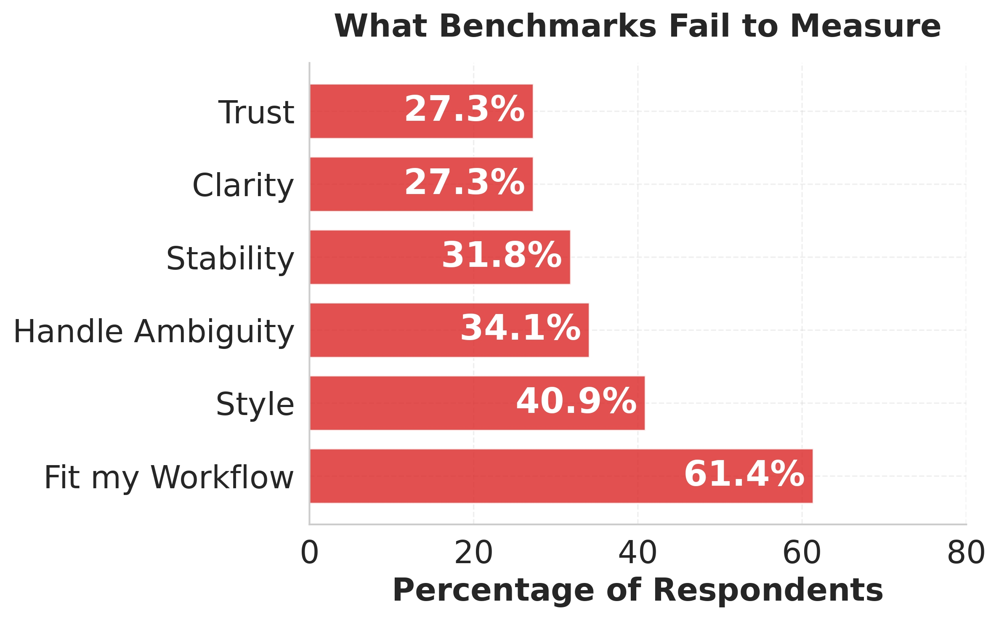
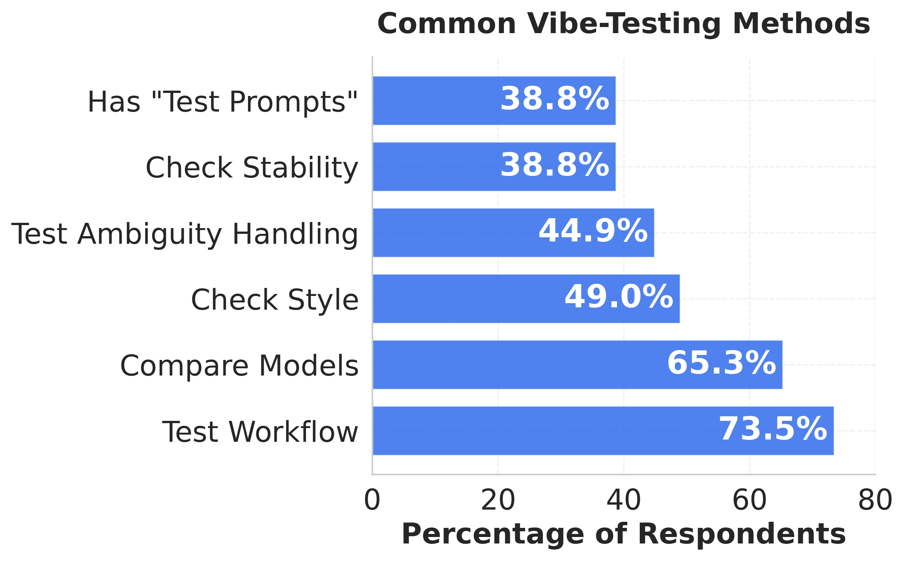
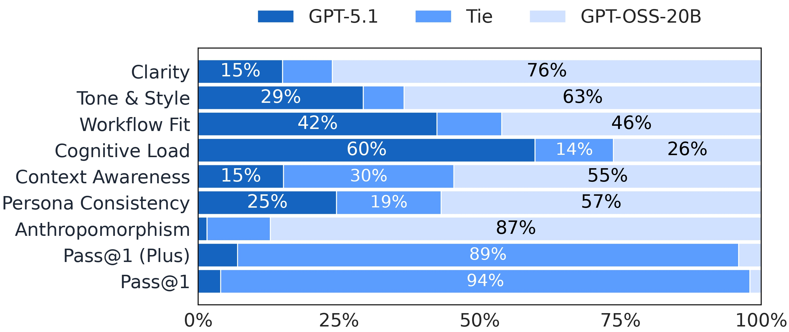
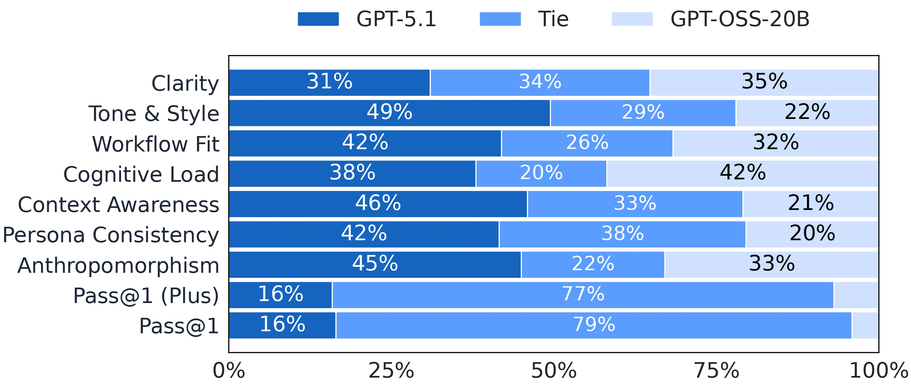
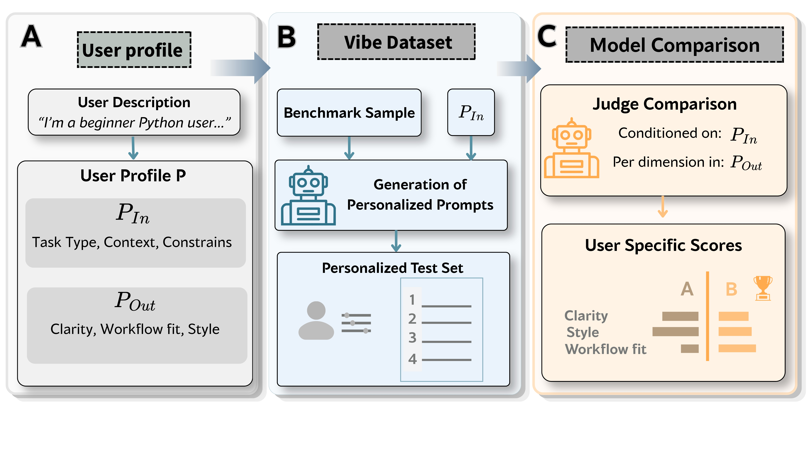

# From Feelings to Metrics

_Understanding and Formalizing How Users VIBE-TEST LLMs._

[](https://arxiv.org/abs/2604.14137)
[](https://technion-cs-nlp.github.io/vibe-testing-llms)
[](mailto:itay1itzhak@gmail.com)
[](scripts/README.md)

---

## 📘 Introduction

This repository contains the code for our paper:

> **From Feelings to Metrics: Understanding and Formalizing How Users VIBE-TEST LLMs**

We study how people actually compare LLMs in practice, formalize that process as a structured evaluation framework, and implement a runnable pipeline for coding tasks. The core idea is simple: users personalize both **what they test** and **how they judge responses**, and those choices can materially change which model is preferred.

The project combines empirical grounding with a full evaluation stack:

- **Real-world evidence** from a survey of user evaluation practices and a curated corpus of in-the-wild comparison reports.
- **A formalization of vibe-testing** into input dimensions for prompt design and output dimensions for response judgment.
- **A reproducible pipeline** for user profiling, prompt rewriting, objective evaluation, pairwise comparison, and downstream analysis on coding benchmarks.

<div align="center">
  
</div>

---

## 📊 Key Results

The website narrative starts with the empirical observation behind the paper: benchmark rankings often miss what users actually care about, so people fall back on ad hoc vibe-testing to compare models in practice.

<div align="center">
  
  
</div>

### Empirical findings

- `82%` of surveyed users reported that they have vibe-tested models.
- `86%` reported that a model had felt meaningfully different from what benchmark scores suggested.
- `83%` expressed interest in more structured or automated vibe-testing workflows.
- We use **in-the-wild model comparison examples** to define vibe-testing input dimensions and output dimensions, grounding the framework in how people already test and judge models in practice.
- The formalization is backed by both survey evidence and a curated corpus of comparison reports from blogs, forums, tech media, and social platforms.

### From empirical study to pipeline

Building on those empirical findings, the paper turns vibe-testing into a reproducible evaluation setup. It separates **what users test** from **how users judge outputs**, then instantiates that idea as a three-part pipeline: user profiling, vibe dataset construction, and head-to-head model comparison.

### Experimental results

The main experimental takeaway is that **personalization is not just presentation**. In coding experiments, changing both the prompt framing and the comparison criteria can change which model wins. The table below shows the win rate of **GPT-5.1** against **GPT-4o** across the four personas reported in the paper.

| Persona | Original prompts | Personalized prompts |
| --- | ---: | ---: |
| `Beginner` | `0.09` | `0.94` |
| `Intermediate` | `0.16` | `0.77` |
| `Researcher` | `0.63` | `0.97` |
| `Advanced` | `0.88` | `0.82` |

<div align="center">
  
  
</div>

Additional findings from the paper:

- LLM judges showed credible agreement with humans for pairwise preference judgments.
- Control paraphrases mostly preserved original rankings, suggesting the strongest shifts come from **personalized** framing rather than generic rewriting.
- Personalization effects were strong for some model pairs and weaker for others, which is exactly the kind of user-model interaction the framework is designed to reveal.

---

## 🧭 Pipeline Overview

The paper presents the proof-of-concept pipeline as three stages in **Figure 3**:

- **(A) User profiling**: build a structured user profile `P` from a short natural-language description, including input preferences `P_in` and output preferences `P_out`.
- **(B) Vibe dataset construction**: rewrite benchmark samples into personalized prompts aligned with `P_in`, while checking semantic preservation so the task intent remains intact.
- **(C) Model comparison**: compare two model responses from the same user perspective using `P_out`, producing per-dimension head-to-head comparisons.

<div align="center">
  
</div>

The current codebase supports function-level evaluation on the benchmarks `MBPP+` and `HumanEval+`.

---

## ⚙️ Installation

We recommend starting from a clean Python environment:

```bash
python -m venv .venv
source .venv/bin/activate
pip install -r requirements.txt
```

Create a repository-local `.env` file with the shared cache root expected by the pipeline:

```bash
HM_HOME=/your/path
```

If you use API-backed models, also export the credentials required by the model configs you plan to run.

---

## 🚀 Quick Start

The easiest way to reproduce a basic experiment is to use the YAML-based orchestrator documented in `scripts/README.md`.

### 1. Inspect the bundled example configuration

```bash
python scripts/run_experiment.py configs/experiments/example_experiment.yaml --dry-run
```

### 2. Run the example experiment

```bash
python scripts/run_experiment.py configs/experiments/example_experiment.yaml
```

### 3. Run an API-only slice

This is the lowest-friction entry point if you do not want to run local GPU-backed models:

```bash
python scripts/run_experiment.py configs/experiments/example_experiment.yaml --model-tags api
```

### 4. Check what has already completed

```bash
python scripts/run_experiment.py configs/experiments/example_experiment.yaml --status
```

---

## 🧪 Reproducing Basic Experiments

### A. End-to-end orchestrated run

Use the recommended experiment config to run the default persona and model matrix:

```bash
python scripts/run_experiment.py configs/experiments/example_experiment.yaml
```

### B. Reproduce only selected stages

This is useful when you want to rebuild the dataset and rerun objective scoring without repeating the full pipeline:

```bash
python scripts/run_experiment.py configs/experiments/example_experiment.yaml --stages dataset objective
```

---

## 🔗 Resources

- **Paper**: [arXiv](https://arxiv.org/abs/2604.14137)
- **Project website**: [project website](https://technion-cs-nlp.github.io/vibe-testing-llms)
- **Experiment orchestrator docs**: `scripts/README.md`
- **Example experiment config**: `configs/experiments/example_experiment.yaml`
- **Project page source**: `website/index.html`

---

## 📚 Citation

```bibtex
@misc{feelings_to_metrics_2026,
  title        = {From Feelings to Metrics: Understanding and Formalizing How Users VIBE-TEST LLMs},
  author       = {Itzhak Itay, Eliya Habba, Gabriel Stanosky, Yonatan Belinkov},
  year         = {2026},
  note         = {Under review},
  url          = {https://arxiv.org/abs/2604.14137}
}
```


---

## 📜 License

MIT License, Copyright (c) 2026

---

## 📬 Contact

For questions or collaborations, please open a GitHub issue or reach out via email:

- Email: [itay1itzhak@gmail.com](itay1itzhakdotgmail.com)
